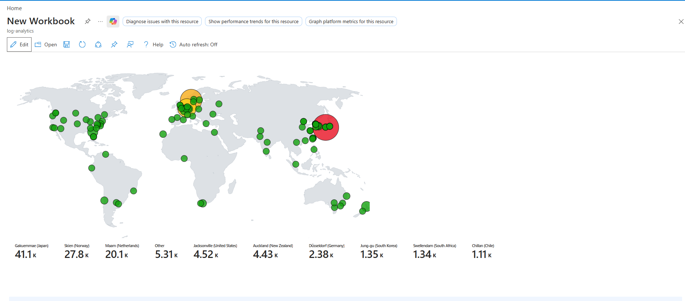

# Azure Honeypot — Attacker Behavior Analysis with Microsoft Sentinel

A hands-on security project: I deployed an exposed Windows VM on Microsoft Azure, connected it to Microsoft Sentinel for centralized log analysis, let it absorb real, live attack traffic from the internet for 48 hours, then used KQL to analyze attacker behavior patterns at scale.

## Problem Statement

Internet-facing systems are scanned and attacked constantly, often within minutes of exposure. This project set out to answer:
- How much attack traffic does a single exposed endpoint actually receive?
- Is that traffic concentrated (few dedicated attackers) or diffuse (broad opportunistic scanning)?
- Where does it originate geographically?
- What usernames/credentials are attackers actually trying?
- Does any of it succeed?

## Methodology

1. Deployed a Windows VM on Microsoft Azure with an intentionally permissive Network Security Group and the Windows Firewall disabled — turning it into a honeypot.
2. Connected the VM to a Log Analytics Workspace and Microsoft Sentinel via the Windows Security Events (AMA) connector.
3. Let the VM sit exposed to live internet traffic for 48 hours, collecting Windows Security Event logs.
4. Imported a GeoIP watchlist into Sentinel to enrich attacker IP addresses with geographic location data.
5. Queried and analyzed the resulting dataset using KQL.
6. Built a Sentinel Workbook to visualize attacker geography on a live attack map.

## Key Findings

### 1. Attack Volume
- **108,289** total failed login attempts recorded over 48 hours
- **239** unique attacking IP addresses

### 2. Attack Concentration
- The top 3 attacking IPs alone accounted for **89,102 attempts — approximately 82% of all attack volume**
- This strongly suggests a small number of dedicated, automated brute-force sources doing the bulk of the work, with a long tail of broader opportunistic scanning contributing the remainder

### 3. Geographic Distribution
Attacks originated globally, with the top sources being:

| Country | City | Attempts |
|---|---|---|
| Japan | Gakuemmae | 41,142 |
| Norway | Skien | 27,812 |
| Netherlands | Maarn | 20,148 |
| United States | Jacksonville | 4,781 |
| New Zealand | Auckland | 4,433 |
| Germany | Düsseldorf | 2,392 |
| South Korea | Jung-gu | 1,353 |
| Chile | Chillan | 1,112 |
| South Africa | Swellendam | 1,047 |
| Sweden | Stockholm | 625 |
| Spain | San Cristóbal de La Laguna | 550 |

*(15+ countries represented in total)*

### 4. Credential Targeting Patterns
- **53,806** attempts (roughly half of all traffic) targeted usernames derived from the VM's own hostname (`EAST1`, `CORP`) — indicating attackers actively fingerprinted the target rather than relying purely on generic wordlists
- Remaining attempts targeted standard administrative account names: `ADMINISTRATOR` (9,259), `ADMIN` (5,442), `USER` (4,251), `SYSTEM` (3,528), and the Spanish-language variant `ADMINISTRADOR` (3,357) — consistent with the observed Spain-origin traffic

### 5. Outcome
- **Zero successful logons** were recorded from any of the 239 attacking IPs, despite over 108,000 combined attempts
- The honeypot held up under sustained, real-world, automated attack

## Tools Used
- Microsoft Azure (Virtual Machines, Networking)
- Microsoft Sentinel (SIEM)
- Log Analytics Workspace
- KQL (Kusto Query Language)
- Sentinel Watchlists (GeoIP enrichment)
- Sentinel Workbooks (attack map visualization)

## What I'd Do Next
- Extend the analysis with a Logic App playbook to auto-block top attacking IPs in real time
- Add Microsoft Defender for Endpoint to compare host-based detection against the SIEM-only view
- Run the same experiment across multiple VM locations/regions to compare regional targeting differences
